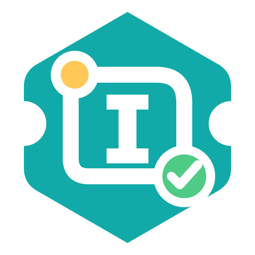
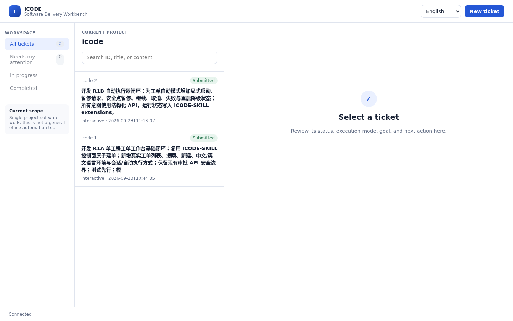

<div align="center">



# ICODE Agent

**一个必须证明自己所声称工作过程的可审计 AI 编码 Agent。**

[ICODE-SKILL](https://github.com/ayukyo/icode-skill) 的执行平面：契约驱动、失败关闭、可恢复，并产出可独立校验的过程证据。

[English](README.md) · [官网源码](site/index.html) · [产品架构](docs/icode-agent-product-architecture.md) · [路线图](docs/roadmap.md) · [安全政策](SECURITY.md)

</div>

## 为什么还要做一个编码 Agent？

多数工作流工具审查 Agent 最终提交了什么。ICODE Agent 要审计的是**实际执行过程**：工具决策、副作用、状态迁移、步骤产物和验证回执都在工作发生时留下记录。

目标不是宣称模型永远不会犯错，而是一条更窄、可测试的原则：

> 运行时无法证明完成，就不能报告已经完成。

## ICODE Agent 和 ICODE-SKILL 的关系

这是两个职责不同、相互独立的仓库。

| 组件 | 职责 | 关系 |
| --- | --- | --- |
| [ICODE-SKILL](https://github.com/ayukyo/icode-skill) | 工作流契约、门禁、状态机和事件账本 | 固定版本、只读消费的控制平面，位于 `vendor/icode-skill` |
| **ICODE Agent**（本仓） | 模型循环、工具、审批、隔离、恢复和证据包装 | 自主执行平面 |

```text
用户 / CI / 本地工作台
          │
          ▼
┌──────────────────────────────────────┐
│ ICODE Agent：模型循环 · Guard · 工具 │
│ 审批 · 隔离 · 恢复                    │
└────────────────┬─────────────────────┘
                 │ 显式 JSON/CLI 契约
                 ▼
┌──────────────────────────────────────┐
│ ICODE-SKILL：门禁 · 状态 · 事件账本  │
└────────────────┬─────────────────────┘
                 ▼
             可校验证据包
```

本 Agent 不通过 `/icode plan` 或另一个宿主 Agent 代替自己执行。它读取锁定版本的工作流契约，并把 `icode_control.py` 作为唯一状态写入口。

## 快速开始

需要 Git、Python 3.11+ 和已初始化的 ICODE-SKILL 子模块。离线检查不需要模型密钥。

```bash
git clone --recurse-submodules https://github.com/ayukyo/icode.git
cd icode
python3 -m venv .venv
. .venv/bin/activate
python -m pip install -e .

icode doctor
icode steps
```

在一次性工作区跑离线契约握手：

```bash
mkdir -p /tmp/icode-handshake
icode handshake --workspace /tmp/icode-handshake
```

参与仓库开发时也可以不安装：

```bash
PYTHONPATH=src python -m icode.cli doctor
python -m unittest
python scripts/preflight.py
```

## 当前真实能力

| 能力 | 状态 | 验证入口 |
| --- | --- | --- |
| 动态工作流契约与离线握手 | 可用 | `icode doctor`、`icode handshake` |
| 带边界的模型 Tool Loop | 可用 | `icode step-run`、`icode task` |
| 默认拒绝 Guard 与人在环审批 | 可用 | 终端审批与仅 loopback 的 WebUI |
| 副作用回执与歧义动作停止 | 可用 | operation start/finish 记录 |
| 带独立校验器的证据包 | 可用 | `icode evidence`、`icode verify-pack` |
| 检查点与证据驱动恢复 | 可用 | `icode recover` |
| 本地审批台与双语工程工作台 | 可用 | `icode webui`、`icode workbench` |
| 六阶段完全自主链路 | 开发中 | `plan` 已验证；后续阶段闭环仍在路线图中 |

### 让 Agent 真正修改代码

```bash
icode task --fixture pycalc --backend openai-compatible
```

靶场会先复制到临时工作区。模型只能修改副本；结束后由 ICODE 再独立执行一次验收测试，不相信模型的自我声明。

### 执行一个受契约约束的步骤

```bash
icode step-run \
  --workspace /tmp/my-project \
  --step plan \
  --backend openai-compatible
```

它会建单、复检边界、登记产物哈希、记录推理 trace，再请求控制面推进状态。被门禁拒绝的迁移保持拒绝，并明确展示原因。

### 打开本地工程工作台

```bash
icode workbench --workspace /path/to/project
```

工作台只监听 loopback，以中文或英文显示真实控制面工单状态；普通用户先看到任务信息，技术细节仍可按需展开。



## 命令入口

| 命令 | 用途 | 是否联网 |
| --- | --- | --- |
| `icode doctor` | 检查契约、Guard、隔离和本机能力 | 否 |
| `icode steps` / `brief` / `outline` | 渐进查看工作流契约 | 否 |
| `icode handshake --workspace <dir>` | 跑通完整离线契约握手 | 否 |
| `icode step-run --workspace <dir> --step plan` | 执行一个受契约约束的模型步骤 | 是 |
| `icode task --fixture pycalc` | 在靶场副本内执行模型编码任务 | 是 |
| `icode chain --workspace <dir> --requirement "..."` | 尝试状态机派生的六阶段链路 | 是 |
| `icode evidence --ticket <dir> --dest <dir>` | 导出可独立校验的证据包 | 否 |
| `icode verify-pack <dir>` | 校验已导出的证据包 | 否 |
| `icode recover --ticket <dir> --step <step>` | 分析或显式恢复中断步骤 | 否 / 恢复时是 |
| `icode webui` | 在 `127.0.0.1` 启动本地审批台 | 否 |
| `icode workbench --workspace <dir>` | 启动单工程工单工作台 | 否 |

当前参数和默认值以 `icode <command> --help` 为准。

## 可信边界

- 通过校验的证据包证明记录自洽并能发现篡改，**不证明代码绝对没有缺陷**。
- 包摘要需要外部可信渠道锚定才具备抗抵赖性；整包持有者可以替换并重新签署一份未锚定的包。
- Guard 是应用层策略。没有可用的内核/容器隔离后端时，ICODE 会如实报告，不把 Guard 称为沙箱。
- 宿主、模型、部署状态和真实设备结果都需要各自的证据；生成报告不等于做过设备测试。
- 公开官网是纯静态页面：无登录、无统计、无跟踪器，不读取或上传工单。

把 ICODE 用于敏感仓库或凭据之前，请阅读[安全政策](SECURITY.md)。

## 文档入口

- [产品架构](docs/icode-agent-product-architecture.md)：执行平面/控制平面边界与端到端数据流
- [方案与决策](docs/design-decisions.md)：已确认决策、被否方案和架构不变量
- [开发路线图](docs/roadmap.md)：已完成阶段与剩余缺口
- [上游依赖面](docs/upstream-contract.md)：ICODE-SKILL 的精确读写接口
- [竞品与格局](docs/agent-landscape.md)：有证据边界的相邻项目比较
- [品牌资产](docs/brand-assets.md)：复用图标的来源、许可和内容哈希

## 参与贡献

欢迎 Issue 和 Pull Request。请先阅读 [CONTRIBUTING.md](CONTRIBUTING.md)；安全敏感问题请走 [SECURITY.md](SECURITY.md) 中的私密渠道，不要提交公开 Issue。

## 许可

[MIT](LICENSE)。复用的 ICODE 图标从 ICODE-SKILL 原样复制并保留上游 MIT 归属，详见[品牌资产说明](docs/brand-assets.md)。
