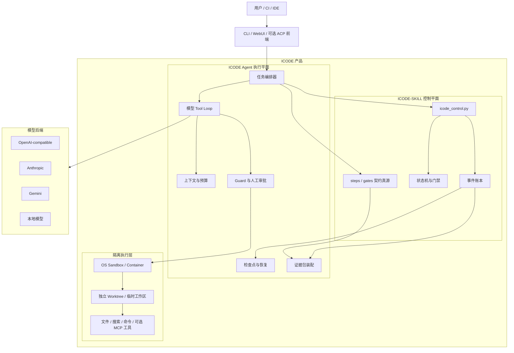
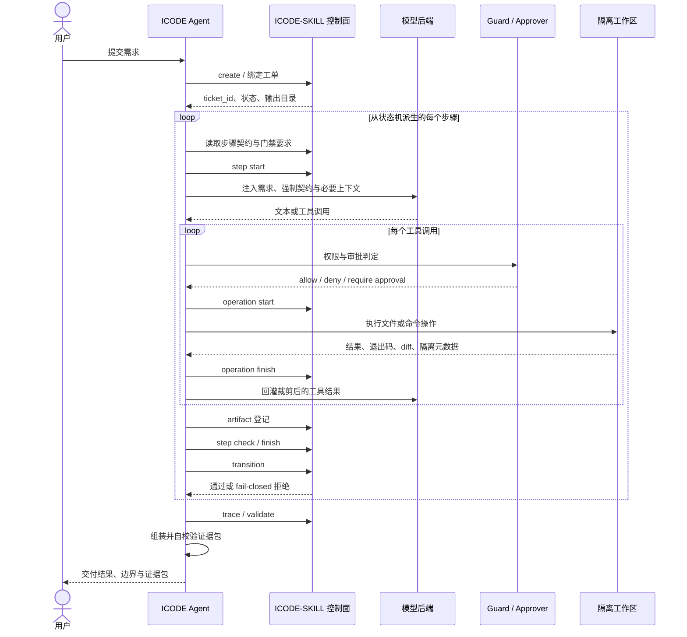

# ICODE Agent 产品架构与 ICODE-SKILL 边界（讨论稿）

- 日期：2026-09-23
- 状态：**讨论稿 v0.3，已确认总体方向与第一版 UI 定位，尚未回写正式决策与路线图**
- 讨论目标：明确为什么需要独立 ICODE Agent、它与 `icode-skill` 子仓库之间的边界，以及如何分阶段吸收主流开源 Agent 的高价值机制并形成 ICODE 原生创新
- 关联文档：[方案与决策](./design-decisions.md) · [开发路线图](./roadmap.md) · [上游依赖面](./upstream-contract.md) · [竞品调研](./agent-landscape.md)

---

## 1. 本文结论摘要

### 1.1 产品定义

ICODE 的最终产品不是 `icode-skill` 的界面包装，也不是 Claude Code、Codex、Cursor 等外部 Agent 的治理 sidecar，而是：

> **一个原生过程可审计、默认隔离、契约驱动，能够脱离其他编码 Agent 独立完成软件工程任务的自主 Agent。**

完整产品由两部分共同组成：

```text
ICODE 产品 = ICODE Agent 执行平面 + 固定版本的 ICODE-SKILL 控制平面
```

- `ICODE-SKILL` 定义“什么算正确”：流程、状态机、步骤契约、门禁、事件账本和控制面裁决。
- `ICODE Agent` 负责“怎样真正做到”：模型循环、上下文、工具、沙箱、审批、恢复和产物生成。

因此：

> ICODE Agent **独立于外部宿主 Agent**，但**不独立于 ICODE-SKILL 逻辑真源**。

### 1.2 “主要调用 ICODE-SKILL”的准确含义

“主要调用”不是指所有执行逻辑都委托给子仓库，而是指：

- **逻辑裁决权**主要来自 ICODE-SKILL；
- **自主执行能力**主要由 ICODE Agent 实现；
- Agent 可以更换模型、工具和前端，但不得绕过、复制或自行改写控制平面的流程裁决。

一句话边界：

> **ICODE-SKILL 是规范与控制平面，ICODE Agent 是自主执行平面。**

### 1.3 能力建设策略

ICODE 采用“**原生内核 + 分阶段吸收成熟机制**”的路线：

- 不 fork 某个现有 Agent 作为产品内核；
- 不调用其他编码 Agent 代替自身执行核心任务；
- 借鉴经过验证的执行机制、接口模式和失败处理方法；
- 优先复用开放协议与边界清楚的基础库；
- 将创新集中在 ICODE-SKILL 契约驱动、步骤最小权限、门禁驱动上下文和全过程证据闭环。

原则是：

> **借鉴机制和接口，不照搬产品架构；复用库和开放协议，不外包核心控制权。**

高价值能力原则上都可以吸收，但必须按依赖关系分阶段进入，不能在单 Agent 闭环和隔离基线尚未成立前堆叠多 Agent、插件和入口。

---

## 2. 为什么不能只使用 ICODE-SKILL

ICODE-SKILL 已经能够让 Claude Code、Codex、CodeBuddy 等宿主理解并执行 ICODE 流程。如果新项目仍然把以下能力交给宿主：

- 模型回合循环；
- 工具选择与执行；
- 权限判定；
- 沙箱；
- 上下文压缩；
- 中断恢复；
- 最终完成判定；

那么新项目只是 ICODE-SKILL 的另一个入口，没有足够的独立产品价值。

独立 ICODE Agent 的必要性来自“软约束”与“硬控制”的差别：

| 维度 | ICODE-SKILL + 外部宿主 | 独立 ICODE Agent |
|---|---|---|
| 模型循环 | 宿主控制 | ICODE 控制 |
| 流程遵循 | 依赖模型理解提示 | 运行时强制 |
| 工具边界 | 宿主决定 | ICODE Guard 与 Sandbox 决定 |
| 状态恢复 | 依赖宿主会话 | ICODE 自有检查点与事件链 |
| 完成判定 | 宿主可能提前声称完成 | 契约与门禁裁决 |
| 过程证据 | 无法完整覆盖宿主内部过程 | 从模型决策到状态迁移均可留痕 |
| 模型选择 | 受宿主限制 | ICODE 原生 backend 抽象 |

只有当 ICODE 自己掌握完整执行循环，“过程可审计”才可能从行为约定升级为运行时能力。

---

## 3. 关键术语与目标边界

“独立”“孤立”“自主”“可审计”是四个不同目标，缺一不可。

| 目标 | 定义 | 最低验收标准 |
|---|---|---|
| **独立** | 不依赖 Claude Code、Codex、Cursor 等外部 Agent 才能工作 | 仅依赖 ICODE、固定版本 ICODE-SKILL、Git、Python、模型 API 即可执行任务 |
| **孤立/隔离** | Agent 的错误或恶意动作不能越过任务安全边界 | 独立工作区、工作区外默认只读、默认断网、受保护路径不可写、隔离失败拒绝执行 |
| **自主** | Agent 自己完成从需求到审计的执行闭环 | 自有 Tool Loop、上下文、预算、验证、恢复与完整步骤推进 |
| **可审计** | 关键执行声明可以被外部独立验证 | 契约、事件、产物、命令退出码和状态迁移形成一致证据包 |

目标不是让模型永远不犯错，而是：

> 模型犯错时不能绕过边界；无法证明完成时，运行时不得宣称完成。

---

## 4. 总体架构



### 4.1 架构不变量

以下规则应作为不可破坏的架构约束：

1. ICODE-SKILL 是流程和状态的唯一真源。
2. ICODE Agent 是模型与工具执行的唯一编排者。
3. 所有正式状态写入必须经过 `icode_control.py` 控制面。
4. UI、模型和工具均不得直接修改工单状态或事件账本。
5. Agent 不复制 `gates.json`、状态机或步骤顺序形成第二套真源。
6. 子模块缺失、版本不符或契约不兼容时，生产模式拒绝启动。
7. 隔离不可用时不得静默降级为裸执行。
8. 状态、检查点和模型自述冲突时，以控制面事件链为准。

---

## 5. 职责划分

### 5.1 ICODE-SKILL：控制平面与逻辑真源

ICODE-SKILL 负责：

- 工单生命周期与状态机；
- 步骤顺序及合法迁移；
- 各步骤输入、输出和复检契约；
- 门禁规则与 fail-closed 裁决；
- artifact 登记与正文摘要绑定；
- operation start/finish 副作用账本；
- reasoning trace 的等级、词表和最低要求；
- 事件链及未闭合步骤、动作和 Agent 投影；
- 上游协议兼容和历史工单迁移规则。

Agent 对这些内容只能读取或通过公开控制面调用，不能在本仓重新实现一份等价逻辑。

### 5.2 ICODE Agent：自主执行平面

ICODE Agent 负责：

- 直接调用模型 API；
- 有界模型回合循环；
- Planner、Executor、Reviewer 等内部角色；
- 渐进式上下文披露与压缩；
- 工具注册、参数校验和输出截断；
- 命令级权限策略与人工审批；
- OS 沙箱、容器和独立工作区；
- 预算、超时、重试和终止条件；
- 工具执行前后的 operation 回执调用；
- 根据契约生成和登记产物；
- 中断恢复、歧义副作用处理；
- 将控制面事实与执行证据组装为可验证证据包；
- CLI、WebUI，以及未来可能的 IDE/ACP 前端。

### 5.3 能力归属矩阵

| 能力 | ICODE-SKILL | ICODE Agent |
|---|---:|---:|
| 状态机 | 定义与裁决 | 请求推进 |
| 步骤顺序 | 唯一真源 | 动态派生 |
| 步骤产物合同 | 定义 | 生成、验证、登记 |
| 门禁 | 定义与执行 | 提交事实并处理结果 |
| 事件账本 | 写入与查询 | 调用、恢复、导出 |
| 模型推理 | 不负责 | 负责 |
| Tool Loop | 不负责 | 负责 |
| 文件和命令执行 | 不负责 | 负责 |
| 沙箱与 worktree | 不负责 | 负责 |
| UI 与审批交互 | 不负责 | 负责 |
| 证据事实 | 提供控制面事实 | 汇总执行事实并打包 |

---

## 6. 子仓库依赖与调用面

### 6.1 版本关系

`vendor/icode-skill` 是 ICODE Agent 的必需逻辑依赖，通过 gitlink 固定到具体提交。`branch=main` 只用于手动升级，不代表运行时自动跟随主干。

生产和 CI 模式必须满足：

```text
vendor/icode-skill 已初始化
+ 实际 HEAD 等于 gitlink
+ 子模块工作树干净
+ 控制面兼容性握手通过
= 允许启动
```

开发模式可以允许 `--skill-root` 或 `ICODE_SKILL_ROOT` 显式覆盖，但必须：

- 明确显示“开发覆盖模式”；
- 记录实际路径、commit 和 dirty 状态；
- 将这些信息写入运行报告和证据包；
- 禁止静默搜索兄弟目录后继续执行。

### 6.2 Agent 消费的上游接口

当前正式调用面应继续限定为：

| 上游能力 | Agent 使用方式 |
|---|---|
| `mcp/workflow-gate/gates.json` | 读取步骤契约、状态机和门禁元数据 |
| `mcp/reasoning-gate/gates.json` | 读取思考等级和 trace 要求 |
| `steps/*.md` | 渐进披露步骤语义，不全量注入 |
| `tools/icode_control.py` | 唯一状态写入与裁决入口 |
| `references/*.md` | 按步骤和问题需要读取 |

明确不消费：

- `/icode <step>` slash 命令；
- 面向 Claude Code、Codex、CodeBuddy 的宿主命令桥；
- `install.sh`；
- 通过另一个宿主 Agent 代替本 Agent 执行步骤的入口。

### 6.3 控制面操作

Agent 应通过稳定的 JSON 协议调用以下能力：

| 操作 | 目的 |
|---|---|
| `create` | 创建并绑定工单 |
| `step start/check/finish` | 开始步骤、边界复检和终结 |
| `artifact` | 登记产物及摘要 |
| `operation start/finish` | 登记副作用意图和结果 |
| `transition` | 请求状态迁移，由控制面执行门禁 |
| `trace` | 查询事件链和未闭合投影 |
| `validate` / `check-outputs` | 整体或产物契约校验 |
| `policy` | 获取副作用失败后的重试/回退决策 |

控制面调用应保持 `shell=False`、参数列表、显式 UTF-8、输出 schema 校验和超时限制。

---

## 7. 完整任务时序



### 7.1 完成判定

模型输出“完成”不构成完成。正式完成至少需要：

```text
必需产物存在
+ 产物已登记并与摘要一致
+ 要求的验证命令已实际执行
+ 所有副作用已闭合
+ 当前步骤 finish 成功
+ 状态迁移门禁通过
+ 无未闭合 step / operation / agent
+ 证据包自校验通过
= ICODE Agent 可以声明完成
```

---

## 8. 扩展协议的定位

独立 Agent 不等于封闭系统。MCP、ACP、Skills 和 Hooks 可以存在，但只能作为扩展接口：

```text
IDE  ──ACP──> ICODE Agent
工具 ──MCP──> ICODE Agent
规则 ─Skills/Hooks──> ICODE Agent
```

不得演变为：

```text
ICODE Agent ──调用 Claude Code/Codex──> 由外部 Agent 完成核心任务
```

边界规则：

- ACP 用于让 IDE 承载 ICODE，而不是把控制权交给 IDE Agent；
- MCP 用于扩展工具，不得获得工单状态和事件账本的直接写权限；
- Skills 用于领域知识和执行方法，不得覆盖控制面契约；
- Hooks 可以收紧策略，不得绕过 Guard、Sandbox 或状态机。

---

## 9. 数据与证据模型

### 9.1 三类状态必须分离

| 状态 | 真源 | 用途 |
|---|---|---|
| 业务流程状态 | ICODE-SKILL 事件链 | 决定工单实际处于哪个阶段 |
| Agent 恢复状态 | Agent checkpoint | 记录回合、上下文摘要和恢复位置 |
| 工作区状态 | Git/worktree + 文件系统 | 记录真实代码与产物变化 |

冲突优先级：

```text
控制面事件链 > 真实工作区状态核验 > Agent checkpoint > 模型自述
```

checkpoint 不能成为第二套工单状态机，也不能自行宣告步骤完成。

### 9.2 证据包至少绑定

- ICODE Agent 版本和 commit；
- ICODE-SKILL gitlink、实际 HEAD 和 dirty 状态；
- 工作仓 commit、分支和初始 dirty 状态摘要；
- 模型 provider、model、请求统计和预算结果；
- 实际隔离后端及能力探测结果；
- 控制面事件链与契约快照；
- 产物正文和链上摘要对应关系；
- 工具调用、验证命令、退出码和裁剪说明；
- 最终状态和所有未闭合投影。

证据包只能证明已覆盖的事实，不能把“记录自洽”等价为“实现绝对正确”。

---

## 10. 安全与隔离边界

### 10.1 隔离层次

| 层次 | 目标 |
|---|---|
| 独立 worktree/临时工作区 | 隔离并发任务和原始工作树 |
| Guard | 对工具和命令进行语义判定 |
| Approver | 对需要人类承担风险的动作显式确认 |
| OS Sandbox/Container | 从内核层限制文件、网络、进程和设备访问 |
| ICODE-SKILL operation ledger | 记录副作用意图、结果和歧义状态 |

任何一层都不能替代其他层：operation 回执可以记录破坏动作，但不能阻止动作；应用层白名单可以降低误操作，但不能冒充内核隔离。

### 10.2 受保护对象

至少需要单独保护：

- 原始工作树；
- `.git/` 与 hooks；
- `vendor/icode-skill/`；
- ICODE 工单事件链；
- checkpoint 与证据目录；
- 用户主目录、SSH 配置、凭据和系统路径；
- 网络和外部服务写操作。

### 10.3 命令策略

命令权限必须按“程序 + 子命令 + 参数 + 工作目录 + 隔离能力”判断，不能只按首词白名单。

例如：

| 命令 | 默认策略 |
|---|---|
| `git status` / `git diff` | 允许，只读 |
| `python -m unittest` | 允许，在隔离工作区执行 |
| `git add` | 受管写入，登记 operation |
| `git commit` | 默认需要审批 |
| `git push` | 外部副作用，默认拒绝或强制审批 |
| `git clean/reset/checkout` | 破坏性动作，默认拒绝 |
| `python -c` / `node -e` | 任意解释器入口，默认拒绝或严格沙箱 |

---

## 11. 独立 Agent 的验收标准

### 11.1 必需环境

验收环境中不得安装或调用 Claude Code、Codex、Cursor、CodeBuddy 等外部编码 Agent。允许依赖：

- ICODE Agent 安装包；
- 固定版本 ICODE-SKILL；
- Python 3.11+；
- Git；
- 明确声明的隔离后端；
- 至少一个模型 API 或本地模型。

### 11.2 最小闭环验收

选择至少三个非玩具仓库和三个不同类型任务，要求：

1. 从自然语言需求创建工单；
2. 按状态机完成 `plan → review → merge → code → deepcheck → audit`；
3. 所有步骤契约和门禁通过；
4. 所有代码改动发生在隔离工作区；
5. 测试命令退出码为零；
6. 中途强制终止一次后能够安全恢复；
7. 模拟一个未闭合副作用并验证拒绝盲目重放；
8. 导出证据包，并在仓库外独立校验成功；
9. 无外部宿主 Agent 参与执行；
10. 报告 token、耗时、审批次数和失败重试次数。

### 11.3 失败验收

以下注入场景必须 fail-closed：

- ICODE-SKILL 子模块缺失或 HEAD 不匹配；
- 控制面输出字段变化；
- 沙箱存在但无法实际启动；
- 工作区外写入；
- 危险 Git 命令；
- artifact 缺失或摘要不一致；
- operation finish 失败；
- checkpoint 与事件链冲突；
- 模型只在回复中声称产物已生成，但磁盘上不存在；
- 证据包被局部篡改。

---

## 12. 当前实现映射与已知缺口

### 12.1 已具备的骨架

- 独立 Python 包和 CLI；
- OpenAI-compatible 模型后端；
- 最小 Tool Loop；
- `ControlPlane` 子进程适配；
- 动态契约加载与 fail-closed 步骤编排；
- operation 回执；
- checkpoint 与恢复决策；
- evidence pack 和独立校验器；
- bwrap、sandbox-exec、容器、WSL/Job Limits 等隔离抽象；
- 本地 WebUI 审批前端。

### 12.2 当前阻断独立产品成立的问题

| 优先级 | 问题 | 影响 |
|---|---|---|
| P0 | 完整 1→6 链路尚未跑通 | 尚不能证明自主交付闭环 |
| P0 | `git`、`python` 首词白名单过宽 | 危险或任意代码入口可能绕过人工审批 |
| P0 | 当前子模块未初始化，且允许静默回退兄弟目录 | 实际逻辑来源不可复现 |
| P0 | Python 3.11 全量测试当前存在 2 个 WSL 路径失败 | preflight 不是全绿 |
| P1 | 隔离探测主要检查可执行文件存在性 | 不能证明后端实际可用 |
| P1 | 模型后端和工具生态有限 | 独立 Agent 的可用范围不足 |
| P1 | 证据包缺少签名与外部锚定 | 可校验但抗抵赖能力有限 |
| P1 | 真实模型验证主要是单一 pycalc 靶场 | 缺乏复杂任务成功率证据 |
| P2 | 文档的已完成状态与当前实现存在漂移 | 容易形成错误产品声明 |

---

## 13. 主流 Agent 能力吸收与创新路线

本节使用 `R0–R7` 表示**下一版路线重排候选**，避免与现有 `roadmap.md` 已经执行过的 Phase 0–6 混淆。讨论确认并正式回写路线图后，再决定是否替换原阶段编号。

### 13.1 吸收决策

比较三种实现路线后，本文确定采用第三种：

| 路线 | 优点 | 主要风险 | 决策 |
|---|---|---|---|
| Fork OpenHands、Pi 等现有 Agent | 起步快、初始能力多 | 内核受上游架构牵制，ICODE-SKILL 难成为唯一控制面 | 不采用 |
| 调用 Claude Code、Codex、OpenCode 等外部 Agent 执行 | 开发量小、短期效果好 | 退化为治理 sidecar，无法证明执行过程由 ICODE 控制 | 不采用 |
| 原生 ICODE 内核，分阶段吸收成熟机制 | 控制权、审计边界和创新空间完整 | 初期开发量更大，需要严格阶段门槛 | **采用** |

### 13.2 高价值能力准入标准

一个外部机制只有同时满足以下条件，才进入 ICODE 正式路线：

1. 能增强独立执行、可靠性、安全、验证或审计；
2. 已被成熟开源 Agent、公开实现或可复现评测验证；
3. 能通过清晰接口独立测试和替换；
4. 不复制 ICODE-SKILL 的状态机、门禁和事件真源；
5. 能产生机器可检查的结果，而不只是改善主观体验；
6. 收益明显高于引入的运行时、维护和供应链复杂度；
7. 代码级复用前完成许可证、依赖和安全审查。

仅借鉴公开架构思想不等于复制源码。若实际引入代码或库，必须记录来源、版本、许可证、修改情况和依赖摘要。

### 13.3 借鉴矩阵

| 来源 | 参考类型 | 值得吸收的机制 | ICODE 的吸收方式 | 阶段 |
|---|---|---|---|---|
| Pi | 开源实现 | 极简 Agent Kernel、模型无关 backend、扩展边界 | 保持 Tool Loop 小内核，模型与工具都通过稳定协议接入 | R1、R4 |
| SWE-agent | 开源实现/论文 | ACI、结构化 observation、测试反馈循环 | 工具返回结构化观察，失败结果进入有界修复循环 | R1、R3 |
| Aider | 开源实现 | Git-first、Repo Map、编辑后 lint/test、architect/editor 分工 | 使用 Git 作为工作区事实，增加仓库索引与验证闭环 | R1、R3、R4 |
| OpenHands | 开源实现/论文 | Action-Observation、独立工作空间、事件流、stuck detection | 借鉴卡死检测和执行空间隔离，不复制第二套流程事件账本 | R2、R3、R6 |
| OpenAI Codex CLI | 开源实现/公开文档 | 沙箱与审批解耦、worktree、最小权限执行 | 将权限裁决、人工责任和内核隔离拆成独立层 | R2 |
| Cline | 开源实现 | Plan/Act、checkpoint、回滚 | 用于执行恢复和用户纠偏，但完成状态仍以控制面为准 | R2、R3 |
| OpenCode | 开源实现 | 权限模式、主/子代理、LSP 诊断 | 引入结构化权限和诊断反馈，子代理延后到单 Agent 稳定之后 | R3、R6 |
| Continue | 开源实现 | Repo Map、模型/工具扩展、MCP | 用于上下文和开放工具生态 | R4、R5 |
| Goose | 开源实现 | Recipes、MCP、可组合扩展 | 将 Recipe/Skill 作为执行方法，不允许覆盖硬门禁 | R5 |
| Zed Agent | 开源实现/公开文档 | ACP、并行线程、worktree、checkpoint | ACP 只作为前端协议，并行任务使用隔离 worktree | R2、R5、R6 |
| Qwen Code | 开源实现 | 子代理、外部 Agent 协议、多入口 | 借鉴职责受限的子代理，不把外部 Agent 作为核心依赖 | R6 |
| Kiro | 公开产品机制 | Spec-driven、Hooks、任务分解 | 只借鉴公开机制，不形成代码依赖 | R3、R5 |
| Devin | 公开产品机制 | 后台任务、任务分解、并行执行 | 只借鉴任务治理方式，不依赖其运行时 | R6 |

该矩阵描述的是机制来源和设计参考，不代表已经集成，也不代表将某个项目整体列为运行时依赖。

阶段主序固定为：

```text
R0 可信基线
  → R1 独立单 Agent
  → R2 真正隔离
  → R3 自验证
  → R4 上下文与多模型
  → R5 开放生态
  → R6 受控多 Agent
  → R7 可信交付与公开评测
```

后续阶段不得绕过前置阶段的退出门槛。测试、事件留痕和基础证据从 R0/R1 就持续存在；R7 做的是签名、外部锚定和公开可复现评测，不是把验证推迟到最后。

本文是产品级总架构，不直接作为一个跨 R0–R7 的单体实施计划。每个阶段必须在启动前形成独立规格、影响面和验收计划；前一阶段通过退出门槛后，才展开下一阶段。若进入实施，首个可执行范围只能是 R0。

### 13.4 R0：可信基线修复

**目标**：先消除会污染后续能力结论的依赖、测试、权限和文档问题。

工作内容：

1. 强制绑定已初始化、干净且 HEAD 匹配的 ICODE-SKILL 子模块；
2. 取消生产模式的静默兄弟目录回退；
3. 建立控制面 `protocol_version`、schema 和兼容性握手；
4. 修复当前 WSL 路径测试，使 Python 3.11 全量测试和 preflight 全绿；
5. 修复 `git`、`python` 等首词白名单过宽的问题；
6. 统一 README、正式决策、路线图和真实实现状态。

**退出门槛**：

- 子模块缺失、脏工作树、HEAD 不符和协议不兼容均能被正确识别并 fail-closed；
- 全量离线测试退出码为零；
- `git push/clean/reset/checkout`、`python -c` 等危险入口不能自动放行；
- 当前能力声明与可复现实测一致。

### 13.5 R1：独立单 Agent 闭环

**目标**：不借助任何外部编码 Agent，完成一条真实任务的完整 ICODE 工作流。

重点吸收：Pi 的小内核、SWE-agent 的 ACI、Aider 的 Git-first、OpenCode 的有界 Tool Loop。

工作内容：

1. 完善原生模型循环、结构化工具调用和 observation；
2. 从 ICODE-SKILL 动态读取步骤顺序、产物合同和门禁；
3. 修复 `review` 不落盘和 `operation_finish` 残留；
4. 对模型正文产出建立“提取 → schema 校验 → 确定性落盘”通道，不能只靠模型主动调用 `write_file`；
5. 完整跑通 `plan → review → merge → code → deepcheck → audit`；
6. 保持模型、工具、状态机和证据模块边界清晰。

**ICODE 创新**：Tool Loop 围绕“当前 ICODE-SKILL 步骤契约”运行，而不是围绕自由聊天运行。

**退出门槛**：

- 在至少一个非玩具仓库完成 1→6；
- 无 Claude Code、Codex、Cursor、CodeBuddy 等宿主参与；
- 产物、状态、operation 和证据全部闭合；
- 模型只在回复中声称完成、但未落盘时，系统拒绝推进。

### 13.6 R2：真正隔离的执行环境

**目标**：让 Agent 的错误或恶意动作不能越过任务边界。

重点吸收：Codex 的沙箱/审批分离，Cline、Zed 的 worktree，OpenHands 的独立工作空间。

工作内容：

1. 每任务使用独立 worktree 或临时仓库；
2. 独立保护 `.git`、`vendor/icode-skill`、工单账本、checkpoint 和证据目录；
3. 命令按程序、子命令、参数、cwd 和实际隔离能力分类；
4. 对沙箱执行真实启动、自检和负向探测，而不仅检查可执行文件存在；
5. 默认断网，将网络、Git 外部写和包安装拆成独立能力授权；
6. 隔离包装或自检失败时拒绝执行。

**ICODE 创新**：由当前步骤契约动态生成最小执行能力。例如 `plan` 默认只读，`code` 才获得工作区写和测试能力，`audit` 恢复为只读加证据导出。

**退出门槛**：

- 原始工作树、工作区外文件、受保护目录和网络的负向测试全部通过；
- 危险命令即使被模型构造为变体也不能绕过策略；
- 沙箱不可用时无裸执行降级；
- 审批只承担业务风险确认，不被当作隔离替代品。

### 13.7 R3：自验证与有界修复

**目标**：从“能修改”升级到“能根据真实失败证据验证和修复”。

重点吸收：Aider 的 lint/test、SWE-agent 的 observation-feedback、OpenHands 的 stuck detection、OpenCode/Continue 的 LSP 诊断、Cline 的 checkpoint。

工作内容：

```text
修改
  → 静态诊断
  → 编译
  → 单元测试
  → 失败分类
  → 有界修复
  → 回归
  → 独立 Reviewer
```

失败至少分为环境、代码、测试、契约、模型能力和副作用状态不明六类。每次修复必须引用新的失败证据；若证据没有变化，不允许模型重复相同尝试。

验证结果必须绑定到具体 commit/diff、步骤 attempt、实际命令、退出码、执行环境和 artifact hash。

**ICODE 创新**：没有新证据就不允许继续碰运气；没有与当前变更绑定的验证证据就不允许推进状态。

**退出门槛**：

- 失败分类可以稳定决定 retry、fallback、人工介入或停止；
- 重复无进展尝试能被检测并终止；
- 代码变更后验证证据不会错误复用旧结果；
- Reviewer 与 Executor 使用隔离上下文，且 Reviewer 不能修改被审对象。

### 13.8 R4：上下文与模型能力

**目标**：在不牺牲契约完整性的前提下支持大仓库、长任务和多模型。

重点吸收：Aider Repo Map、Continue 代码库上下文、主流 Agent 的 compaction、Pi/OpenCode 的 provider-neutral backend。

工作内容：

1. 建立仓库结构、符号和变更索引；
2. 实现分层上下文、摘要、压缩和重新水合；
3. 原生支持 Anthropic、OpenAI、Gemini 和至少一种本地模型；
4. 按步骤和能力选择模型，但不改变控制面契约；
5. 分离质量指标与 token、耗时、费用等运营指标。

**ICODE 创新**：上下文由“当前未满足门禁需要证明什么”驱动，形成：

```text
当前状态
  → 当前步骤契约
  → 未满足门禁
  → 所需证据
  → 所需文件、符号和历史
```

**退出门槛**：

- 至少三个模型后端通过同一离线契约套件；
- 压缩与恢复不会丢失硬门禁、用户约束和未闭合副作用；
- 大仓库任务不需要全量注入源码；
- 模型切换不会产生状态第二真源。

### 13.9 R5：开放生态

**目标**：扩展工具、知识和使用入口，但不转移核心控制权。

重点吸收：Goose Recipes/MCP、OpenCode/Cline/Continue MCP、Zed ACP、主流 Agent 的 Skills、Hooks 和 Plugins。

工作内容：

1. MCP 工具接入；
2. ACP/IDE 前端接入；
3. Skills、Recipes 和生命周期 Hooks；
4. CI、工单和代码托管平台连接器；
5. 为扩展定义权限、输入、输出、副作用和证据 schema。

**ICODE 创新**：扩展不是只有工具 schema，还必须携带可执行权限和证据契约。

**退出门槛**：

- MCP 工具不能直接写控制面或账本；
- ACP 只承载交互，不接管 Agent 循环；
- Hooks 只能收紧硬策略，不能放宽 Guard、Sandbox 或门禁；
- 未声明副作用和证据要求的扩展默认不可执行。

### 13.10 R6：受控多 Agent

**目标**：在单 Agent 稳定后，引入职责明确、权限受限、过程可审计的协作。

重点吸收：OpenHands 多 Agent、Qwen/Cline 子代理、Zed/Codex 并行 worktree、Devin 任务分解。

初始角色限定为：

- Planner；
- Executor；
- Reviewer；
- Verification Agent；
- Evidence Auditor。

每个 Agent 必须拥有独立上下文、明确读写范围、独立 operation 身份，以及独立 worktree 或只读视图。子代理不得自行扩大权限或把写能力继续委派给未知 Agent。

**ICODE 创新**：多 Agent 不是自由聊天或投票，而是由 ICODE-SKILL 契约分配职责、权限和证据责任。

**退出门槛**：

- 并行 Agent 不发生未检测的工作区写冲突；
- Reviewer、Verifier 和 Auditor 默认只读；
- 每项代理结论都能追溯到身份、上下文边界和证据；
- 任一代理失败不会绕过当前步骤门禁。

### 13.11 R7：可信交付与公开评测

**目标**：让 ICODE 的可靠性和差异化能够被外部复现，而不是停留在产品声明。

重点吸收：SWE-agent/Aider 的可复现评测，以及软件供应链签名、attestation 和透明日志思想。

工作内容：

1. 证据包非对称签名；
2. 外部时间戳、CI 或透明日志锚定；
3. 模型、工具、沙箱、代码和依赖 provenance；
4. 多仓库真实任务集；
5. 成功率、首次门禁通过率、恢复率、人工介入率；
6. token、耗时和成本独立统计；
7. 与主流 Agent 执行同任务的公开对比。

**退出门槛**：

- 第三方可以在无 ICODE 运行环境下验证证据包、签名和外部锚定；
- Benchmark 的任务、基线、模型、预算和失败样本均可复现；
- 不用单次成功演示代替统计结论；
- 产品声明能够逐项链接到可验证证据。

### 13.12 ICODE 原生创新体系

上述机制并非简单功能叠加，而是收敛为五项相互配合的 ICODE 能力：

1. **Contract-driven Agent**：模型、工具和步骤执行由 ICODE-SKILL 契约驱动。
2. **Gate-driven Context**：上下文由当前未满足门禁和所需证据驱动。
3. **Evidence-carrying Action**：每个关键动作同时生成可验证回执。
4. **Least-capability Execution**：每个步骤只获得完成当前契约所需的最小权限。
5. **Auditable Multi-Agent**：代理职责、权限和证据责任由状态机约束。

这些机制在其他项目中可能分别存在，但 ICODE 的创新目标是把它们统一到同一个不可绕过的控制平面，并形成可独立验证的端到端证据。

---

## 14. UI 产品设计

### 14.1 目标用户与产品边界

第一版 UI 默认服务普通白领和需求提出者。用户不需要理解代码、Git、模型、测试命令、沙箱、门禁和事件链，也能够提交研发需求、跟踪进展、补充信息、完成审批并查看结果。

“通用办公工单系统”只描述界面形态和使用门槛，不改变产品业务范围：

- 前台交互接近企业 OA、Jira、飞书工单等办公系统；
- 后台仍是面向软件研发任务的 ICODE Agent；
- 不在本阶段扩展为邮件、报表、财务、人事等通用办公自动化平台。

UI 的第一设计原则是：

> **默认面向不懂代码的需求提出者；技术能力通过渐进披露完整保留，但不要求普通用户理解。**

### 14.2 UI 定位

ICODE UI 采用“**工单工作台优先**”，不采用“聊天框优先”。

| 路线 | 优点 | 问题 | 决策 |
|---|---|---|---|
| 聊天优先、工单放侧栏 | 用户熟悉，初始实现简单 | 状态、门禁和证据被聊天记录淹没 | 不采用 |
| 工单工作台优先 | 与 ICODE-SKILL 状态机和流程天然一致 | 需要完整的信息架构 | **采用** |
| 多项目运营大盘优先 | 适合管理团队和大量任务 | 第一版过重，削弱单工单处理体验 | 后续扩展 |

聊天仍然存在，但它是当前工单内的沟通入口，用于补充需求、回答问题和调整目标，不是整个产品的中心。

### 14.3 双层信息架构

同一工单提供两层信息，不维护两套 UI 或两套状态：

```text
默认层：普通办公语言
    ↓ 用户主动展开“技术详情”
专业层：代码、diff、验证、事件链、模型、沙箱和证据
```

普通用户默认不需要看到：

- `plan/review/merge/code/deepcheck/audit` 等内部步骤名；
- artifact、operation、checkpoint 等控制面术语；
- commit、worktree、sandbox 等开发术语；
- token、工具调用参数和原始运行日志；
- 命令行、路径和退出码。

这些事实不能被删除或改写，只是在默认界面中折叠。开发人员、运维人员和审计人员可以展开查看同一份底层数据。

### 14.4 中英文与语言环境

第一版同时支持简体中文和英文。语言选择遵循以下优先级：

```text
用户手动选择
  > 组织或项目默认语言
  > 操作系统 / 浏览器语言环境
  > 产品默认语言（简体中文）
```

具体约束：

- 首批语言标识使用标准 locale：`zh-CN` 和 `en-US`，内部协议保留扩展其他 BCP 47 语言标签的能力；
- 尚未保存偏好时按操作系统或浏览器语言环境选择，已有用户偏好时以保存值为准；
- 用户可在界面中随时切换语言；本地版保存到用户配置，存在账户系统时再同步到其他设备；
- 日期、时间、数字、相对时间和排序规则随 locale 变化；
- 状态、错误和审批由后端返回稳定的代码与结构化参数，前端负责本地化，不把中文或英文展示文本作为业务判断依据；
- 工单标题、需求、评论、代码、命令、路径、原始日志和第三方错误保持原文，不做破坏证据的自动翻译；
- Agent 的提问、进展摘要和交付说明默认使用该工单的沟通语言；需要查看另一语言时生成派生译文，并保留原文入口；
- 某条文案缺失时按“当前语言 → 英文 → 简体中文”回退，并记录可观测告警，不向用户显示资源键名。

“界面语言”和“工单沟通语言”是两个字段：切换界面语言不会篡改既有工单内容；新建工单默认继承当前界面语言，用户可以单独修改。

### 14.5 整体布局

桌面端采用工单列表、当前工单和用户行动区三部分布局：

```text
┌──────────────────────────────────────────────────────────────────┐
│ ICODE                  中文 / EN   搜索工单        ＋ 新建工单   │
├───────────────┬──────────────────────────────────┬───────────────┤
│ 我的工单      │ 当前工单                         │ 需要你处理    │
│               │                                  │               │
│ 需要我处理 2  │ 标题 / 业务系统 / 当前状态       │ 待补充信息    │
│ 处理中     5  │                                  │ 待确认动作    │
│ 已完成    18  │ 工单进度                         │ 风险提示      │
│ 全部工单      │ 当前进展                         │               │
│               │ 沟通 / 结果 / 附件 / 技术详情   │ 确认 / 拒绝   │
├───────────────┴──────────────────────────────────┴───────────────┤
│ 补充说明、回答问题或上传资料……                                  │
└──────────────────────────────────────────────────────────────────┘
```

布局优先回答四个问题：

1. 现在是什么状态；
2. 是否需要用户处理；
3. 为什么暂停或阻塞；
4. 下一步会发生什么。

### 14.6 主导航

第一版主导航保持克制：

- **我的工单**：用户创建或需要用户参与的工单；
- **需要我处理**：等待补充、确认、验收或高风险审批；
- **处理中**：Agent 正在工作的工单；
- **已完成**：已经交付的工单；
- **全部工单**：按权限可见的完整列表；
- **新建工单**：主要行动入口。

运行环境、模型、项目注册和安全策略进入设置区域，不占据普通用户的主导航。

### 14.7 工单列表与搜索

每条工单至少展示：

- 状态图标和状态文字；
- 工单编号和标题；
- 所属业务系统；
- 当前用户可理解的处理阶段；
- 当前执行方式（会话模式或自动模式）；
- 是否需要用户行动；
- 阻塞原因摘要；
- 最近更新时间。

示例：

```text
◉ IC-142  设备断线恢复后任务没有继续
   正在处理 · 割草机管理系统 · 2 分钟前
   需要确认：是否允许在隔离环境运行完整检查

▲ IC-141  新增交付记录签名
   需要补充信息 · ICODE · 18 分钟前
   缺少：正式发布环境的验证方式

✓ IC-139  修复 Windows 路径识别
   已完成 · ICODE · 昨天
   检查通过 · 验收记录已生成
```

搜索和筛选至少覆盖：

- 工单编号、标题和需求正文；
- 业务系统；
- 用户可见状态；
- 当前内部步骤；
- 执行方式；
- 需要用户处理、已阻塞和已完成；
- 创建时间与更新时间范围。

第一版使用本地索引即可，不为了搜索引入独立数据库或远程搜索服务。

### 14.8 新建工单

第一版表单只保留普通用户能理解且确实影响执行的字段：

1. 业务系统；
2. 问题或需求标题；
3. 需要解决的问题；
4. 希望得到的结果；
5. 截图、日志、录屏或其他附件；
6. 紧急程度；
7. 执行方式：会话模式或自动模式；
8. 提交。

示例：

```text
业务系统：割草机管理系统

问题标题：设备断线恢复后任务没有继续

问题描述：
设备短暂断网，重新连接以后，App 显示在线，
但是之前的割草任务没有继续。

希望结果：
网络恢复后能继续之前的任务；
如果无法继续，要明确提示用户原因。

附件：现场录屏.mp4、设备日志.zip
执行方式：会话模式
```

后端负责把用户输入转换为 ICODE-SKILL 需要的 requirement、constraints、acceptance 和工单元数据。若信息不足，Agent 在工单沟通区提出具体问题，而不是要求用户填写技术模板。

浏览器不提交任意本地路径或 shell。业务系统由后端登记并向 UI 提供不透明的 `project_id`，UI 只提交项目选择和需求意图。

### 14.9 会话模式与自动模式

两种模式使用同一个 Agent core、同一个 ICODE-SKILL 控制平面和同一套证据链。它们是执行策略，不是两套产品，也不产生第二套状态机。

后端使用稳定枚举 `interactive` 和 `autonomous`，界面分别本地化为“会话模式 / 自动模式”和“Interactive / Autonomous”。执行方式与工单生命周期状态正交，不能用模式字段替代 `plan`、`code`、`blocked` 等控制面状态。

| 执行方式 | 适用场景 | Agent 行为 | 必须暂停的情况 |
|---|---|---|---|
| 会话模式 | 需求尚在澄清、用户希望逐步参与 | 每轮围绕当前工单沟通、执行和汇报，方便用户随时补充或调整目标 | 需要用户回答、范围改变、受保护动作、控制面门禁不满足 |
| 自动模式 | 目标、边界和验收条件已经明确 | 在授权范围内异步连续推进，可跨页面关闭和客户端离线继续运行 | 强制审批、关键信息缺失、策略上限、无法自修复的门禁失败或环境异常 |

会话模式不等于“聊天框优先”。聊天只是工单中的交互面，工单状态、行动项和证据仍是主界面中心。

自动模式启动前必须向用户展示并固化：

- 本次目标和验收条件；
- 可访问的工程与数据范围；
- 允许自动执行的动作类别；
- 必须人工确认的风险类别；
- 时间、成本、重试和并发上限；
- 完成、阻塞、失败时的通知方式。

自动模式不是“无限权限”或“静默执行”。它仍受 Guard、OS Sandbox、Approval、步骤契约和 fail-closed 策略约束。审批超时、策略无法判定或控制面不可用时必须暂停或拒绝，不能为了自动化而降级放行。

模式切换必须可审计：

- 新工单默认使用会话模式，用户明确选择后才进入自动模式；
- 从会话模式切换到自动模式时，先生成目标、范围和授权摘要供用户确认；
- 从自动模式切换到会话模式时，在安全点创建 checkpoint 后暂停连续推进；
- 切换不重建工单、不清除历史、不改变已经形成的证据；
- 用户可以随时请求暂停或取消，但实际状态变更仍由后端和控制面裁决。

接口同时返回 `requested_execution_mode` 和 `effective_execution_mode`。用户点击切换只会产生模式变更意图；只有 Agent 在安全点完成 checkpoint 且控制面接受后，实际生效模式才改变。UI 在此期间显示“正在切换”，不得提前显示切换成功。

### 14.10 工单详情

普通用户默认看到四个页签：

- **处理进展**：当前状态、阶段进度、时间线和下一步；
- **沟通记录**：Agent 提问、用户补充、方案确认和目标调整；
- **处理结果**：完成内容、检查结果、已知限制和用户待办；
- **附件资料**：用户上传材料和 Agent 生成的交付物。

“技术详情”作为独立折叠入口，展开后显示：

- ICODE-SKILL 原始步骤与状态；
- 修改文件与 diff；
- 编译、测试、lint、命令和退出码；
- 模型与工具调用；
- 门禁、operation 和恢复信息；
- 事件链、artifact 和证据包。

工单抬头同时显示当前执行方式；自动模式还需要显示最近心跳、已用资源、下一处可能暂停点，以及始终可见的“暂停自动处理”入口。

技术详情必须来自原始事实，不得由前端根据自然语言总结反向推断。

### 14.11 状态翻译

UI 不创建第二套业务状态。控制面原始状态必须保留，前端只增加面向普通用户的展示标签和辅助状态。

| 控制面或运行时状态 | 普通用户显示 |
|---|---|
| create/init | 已提交 |
| plan | 正在理解需求 |
| review | 正在检查方案 |
| merge | 方案准备完成 |
| code | 正在处理 |
| deepcheck | 正在全面检查 |
| audit | 正在整理交付结果 |
| completed | 已完成 |
| blocked | 需要补充信息 |
| approval required | 需要你确认 |
| failed | 处理未完成 |

展示模型由三部分组成：

```text
控制面原始状态：review_in_progress
用户可见阶段：正在检查方案
辅助状态：等待用户确认
```

状态不能只靠颜色表达，必须同时使用图标、文字、阶段和行动提示。映射规则应版本化并由后端输出，前端不根据字符串猜测状态。

### 14.12 审批与风险沟通

现有审批台继续作为受保护组件存在，但普通用户先看到业务语言：

```text
需要你的确认

ICODE 准备在隔离的测试环境中运行完整检查。
这不会发布代码，也不会修改正式环境。

预计耗时：约 5 分钟
影响范围：仅当前工单的临时工作区

[暂不允许] [允许本次执行]

查看技术详情
```

技术详情再展示真实工具、命令、cwd、隔离后端、operation class 和风险分类。

危险操作必须明确说明影响范围和不可逆性，默认行动是拒绝。审批不能使用笼统的“继续”或“确定”，而要使用“允许本次执行”“拒绝并停止”等结果明确的按钮文案。

审批只承担业务风险确认，不能替代 Guard 和 OS Sandbox。普通用户即使误点允许，也不能获得超出当前步骤契约的权限。

### 14.13 完成与验收页面

完成页面优先展示业务结果：

```text
工单已完成

完成内容
- 修复断线恢复后的任务状态判断
- 增加无法恢复时的用户提示
- 增加对应检查

检查结果
- 自动检查全部通过
- 原有功能未发现异常
- 尚未在真实设备上验证

需要你做什么
- 请在测试设备上模拟一次断网恢复

[确认结果] [发现问题，重新处理]
```

“证据包”在普通界面中显示为“验收记录”，并说明包含处理过程、修改记录、检查结果和完整性校验。技术详情仍保留 evidence pack、摘要、签名和独立校验入口。

UI 不得把“自动检查通过”改写成“生产环境已经验证”，未验证边界必须与成功项同等可见。

### 14.14 UI 与后端接口边界

现有审批 API 保持独立、严格和最小化：

```text
Approval API：approval_id + decision + reason
```

完整工作台增加四类接口，但仍然只提交意图和受控标识：

| 接口类别 | 职责 | 写入边界 |
|---|---|---|
| Ticket Query | 列表、搜索、状态、详情 | 只读 |
| Ticket Intent | 新建、暂停、继续、取消、补充、确认、请求切换执行方式 | 只提交枚举意图和用户内容 |
| Event Stream | 当前进展、状态变化和审批提醒 | 服务端单向事件 |
| Evidence | 验收记录、技术证据和导出 | 默认只读，导出由后端完成 |

浏览器禁止：

- 直接调用 `icode_control.py`；
- 直接写工单文件、事件链和 checkpoint；
- 提交或拼装任意 shell；
- 自行修改状态；
- 根据聊天文本推断步骤已经完成；
- 绕过 Agent core 访问工作区真实路径。

所有状态变化路径保持：

```text
用户意图
  → UI 后端校验
  → ICODE Agent core
  → ICODE-SKILL 控制面裁决
  → 新状态与事件回传 UI
```

### 14.15 视觉、可用性与无障碍原则

- 使用浅色、中性、接近企业办公系统的视觉风格；
- 大状态清晰，用户行动集中，不使用终端风格作为默认外观；
- 动态内容继续使用安全文本渲染，不使用不受控 HTML；
- 不依赖颜色单独传达状态；
- 所有关键操作支持键盘导航、可见焦点和屏幕阅读标签；
- 错误信息同时说明“发生了什么”和“下一步怎么做”；
- 默认隐藏原始日志，但技术详情必须能追溯；
- 桌面端承担 diff 和证据审查；移动端优先支持查看、补充信息和审批；
- 页面刷新、浏览器关闭和进程重启不得自动放行挂起审批。

### 14.16 UI 分阶段落地

UI 能力随产品主路线演进，不单独绕过后端成熟度：

| 主路线阶段 | UI 交付 |
|---|---|
| R0 | 保留并加固当前审批台；确定中英文词表、locale 解析和状态映射契约 |
| R1 | 单工程工单列表、新建、搜索、状态、进展、沟通、审批，以及会话/自动模式闭环 |
| R2 | 隔离状态、风险说明、权限范围和受保护动作可视化 |
| R3 | 失败分类、验证进展、修复循环和用户待办 |
| R4 | 大仓库进度、模型状态和成本信息进入技术详情 |
| R5 | ACP/IDE、连接器和扩展权限管理，但普通工作台保持稳定 |
| R6 | 多 Agent 角色、并行任务和冲突状态可视化 |
| R7 | 签名验收记录、外部锚定和 Benchmark 报表 |

第一版范围限定为“**单工程内的工单工作台**”。多工程运营大盘、复杂组织权限和管理驾驶舱在单工程闭环稳定后再评估。

---

## 15. 明确不做

- 不把 ICODE Agent 做成 Claude Code、Codex 或 Cursor 的必需插件；
- 不通过调用另一个编码 Agent 来替代自身 Tool Loop；
- 不在 Agent 仓复制 ICODE-SKILL 的状态机和门禁实现；
- 不允许 UI、模型或 MCP 工具成为状态第二写者；
- 不用命令白名单冒充 OS 沙箱；
- 不在完整单 Agent 闭环之前追求大量并行子代理；
- 不以模型自述、聊天记录或“看起来完成”替代契约验收。

---

## 16. 待讨论并拍板的问题

以下问题尚未在本文中替团队做决定。

### Q1：安装包如何携带 ICODE-SKILL

git submodule 适合源码开发，但 `pipx install icode-agent` 时通常不存在 Git 子模块。候选方案：

1. ICODE-SKILL 作为独立的版本化 Python/数据包发布；
2. 构建 ICODE Agent wheel 时嵌入经过校验的只读快照；
3. 首次运行时显式下载固定 commit 并校验摘要；
4. 要求用户单独提供 `--skill-root`。

需要在可复现性、离线安装、升级成本和两仓独立性之间取舍。

### Q2：控制面长期使用 CLI 还是版本化库接口

当前 `icode_control.py + JSON` 的优点是两仓边界清晰、语言无关；缺点是字段协议容易漂移、子进程开销较大。可以讨论：

- 保持 CLI，但增加 `protocol_version` 和 JSON Schema；
- 在 ICODE-SKILL 中发布稳定 Python API，同时保留 CLI；
- Agent 只依赖稳定适配层，不读取控制面内部文件结构。

### Q3：步骤文档如何转成 Agent 可执行指令

需要明确：

- 哪些门禁内容必须逐步强制注入；
- 哪些背景知识按需读取；
- 哪些是面向宿主 Agent 的旧指令，不适用于独立 Agent；
- 是否需要由 ICODE-SKILL 提供机器可读的 Agent contract，而不是继续解析大段 Markdown。

### Q4：证据包由哪个仓定义 schema

候选边界：

- ICODE-SKILL 定义流程事件和契约证据；
- ICODE Agent 定义模型、工具、沙箱和运行环境证据；
- 两者共同版本化一个 evidence manifest schema。

需要避免两个仓分别演进成不兼容的证据格式。

### Q5：第一阶段支持哪些平台和隔离强度

当前跨平台目标是 Windows、macOS、Linux，但三平台内核级隔离成本差异很大。需要决定：

- 是否先将 Linux/bwrap 设为严格生产基线；
- macOS/Windows 在未达到等价隔离前是实验支持，还是允许受限模式；
- “独立 Agent 可发布”的最低隔离级别是什么。

### Q6：Agent 内部角色是否必须是多模型/多进程

Planner、Executor、Reviewer 可以先是同一模型的不同受限上下文，不必一开始就实现并行多代理。需要决定何时才值得升级为真正隔离的多 Agent。

---

## 17. 后续文档同步计划

本文讨论确认后，再执行以下同步，避免在未拍板时制造多份正式真源：

1. 更新 `docs/design-decisions.md`：补充产品组合、控制/执行平面和分发决策；
2. 更新 `docs/upstream-contract.md`：补充严格子模块绑定和协议版本；
3. 更新 `docs/roadmap.md`：按独立 Agent 验收重新排序 P0/P1；
4. 更新 `README.md`：统一产品定位、安全边界和当前完成状态；
5. 增加文档一致性检查，防止阶段状态和安全声明再次漂移。

---

## 18. 讨论用一句话版本

> **ICODE Agent 不依赖其他编码 Agent，自主完成模型与工具执行；ICODE-SKILL 作为固定版本的子仓库，提供不可绕过的流程、契约、门禁和状态真源。两者合在一起才构成完整 ICODE 产品。**
