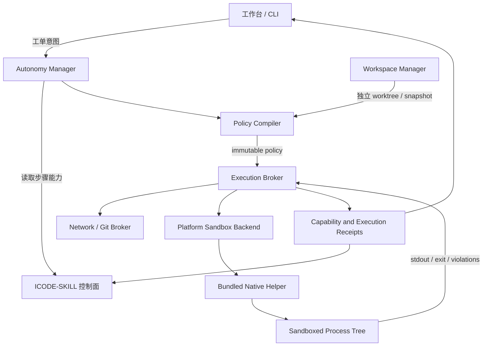

# ICODE Agent R2：跨平台隔离执行环境设计

- 日期：2026-09-23
- 状态：已批准，待实施
- 适用版本：R2
- 目标平台：Linux、macOS、Windows
- 关联文档：[产品总架构](../../icode-agent-product-architecture.md) · [竞品调研](../../agent-landscape.md) · [设计决策](../../design-decisions.md)

## 1. 需求背景

### 1.1 用户目标

ICODE Agent 面向不熟悉终端、权限模型和沙箱术语的普通研发协作人员。用户只需要安装 Python 包、选择工程并新建工单，不应被要求先配置 Docker、WSL、虚拟机或复杂系统组件。

R2 要解决的不是“少弹几个确认框”，而是把 Agent 的实际活动范围限制在当前任务内：即使模型生成错误命令、依赖脚本包含恶意行为，或项目内容诱导 Agent 越权，操作也不能越过任务边界。

用户已经确认以下约束：

1. Linux、macOS、Windows 都必须支持；
2. 三个平台的用户可见能力至少 90% 一致；
3. 安装入口只依赖 Python 包管理，不要求用户另装 Docker、Podman、WSL 或 Node.js；
4. Windows 为实现强网络隔离，允许首次启动时出现一次 UAC 系统确认；
5. 官网和工作台使用普通产品语言，不把“门禁、真源、失败关闭”等内部术语作为首屏卖点。

### 1.2 当前问题

当前 `src/icode/isolation.py` 已有 Bubblewrap、Seatbelt、WSL 和容器包装器，但仍存在以下缺口：

- 探测主要判断可执行文件是否存在，没有完成真实启动和负向验证；
- Linux 依赖系统预装 `bwrap`，Windows 没有文件和网络强制隔离；
- `NoIsolation` 仍可进入命令执行路径，不能作为自动模式的安全底线；
- 工作区、原始仓库、`.git`、工单账本和证据目录尚未形成统一保护模型；
- 当前策略以“命令首词白名单”为主，无法约束被允许程序启动的子进程；
- 能力声明没有绑定操作系统版本、助手程序哈希和实测回执；
- 官网强调内部论证方式，没有直接回答用户“它能帮我做什么、什么时候会找我”。

### 1.3 设计目标

R2 完成后，用户执行一次 Python 包安装并启动 ICODE，即可获得：

- 每个工单独立的任务工作区；
- 工作区外写入、敏感目录读取和默认网络访问的系统级阻断；
- 对子进程继承生效的限制；
- 网络、包安装和远端 Git 写入的单次、可解释授权；
- 任务停止后的进程树回收和工作区保留/清理选择；
- 三个平台统一的状态、错误、审批和恢复体验；
- 可由 `icode doctor` 重复验证的隔离能力回执。

### 1.4 非目标

R2 不包含：

- 多 Agent 并行调度；
- 云端执行平台；
- 用沙箱替代 ICODE-SKILL 的流程状态机和门禁；
- 自动推送代码、自动部署或自动读取宿主机凭据；
- 宣称能抵御操作系统内核漏洞、管理员账户攻击或同等权限宿主进程注入；
- 在不支持必要系统原语的旧系统上退回无隔离自动执行。

## 2. 竞品结论与设计选择

### 2.1 竞品处理方式

| 产品 | 安装与隔离方式 | 可借鉴点 | 不直接采用的原因 |
|---|---|---|---|
| OpenAI Codex | 单一安装入口，底层按平台使用 Seatbelt、Landlock/Bubblewrap、Windows 原生令牌与 ACL | 平台 wheel/二进制携带原生助手；统一策略、分平台强制 | Rust 内核无法直接作为本项目 Python API 使用 |
| Claude Code / Sandbox Runtime | Seatbelt、Bubblewrap、代理网络；Windows 使用随包助手和一次性管理员初始化 | 文件与网络双边界、代理授权、违规提示 | Linux 仍存在系统依赖和 user namespace 环境差异；Windows 仍为 Alpha |
| OpenHands | Docker、远程或云端沙箱 | 独立工作环境、后端可替换 | Docker 是额外前置条件，不符合本项目安装约束 |
| Cline | 编辑器入口和逐动作审批 | 小白友好的审批交互 | 审批不能形成进程级隔离 |
| OpenCode | `allow / ask / deny` 规则 | 结构化权限、规则优先级 | shell 仍继承宿主用户权限，不能作为安全边界 |
| Aider | Python 安装，Docker 可选 | 安装简单、Git 工作流自然 | 默认直接操作本地仓库，隔离强度不足 |

参考：

- [Codex 跨平台沙箱依赖](https://github.com/openai/codex/blob/main/codex-rs/core/README.md)
- [Codex Windows 沙箱设计](https://openai.com/index/building-codex-windows-sandbox/)
- [Claude Code 沙箱设计](https://www.anthropic.com/engineering/claude-code-sandboxing)
- [Anthropic Sandbox Runtime](https://github.com/anthropics/sandbox-runtime)
- [OpenHands 本地与 Docker 运行方式](https://github.com/OpenHands/OpenHands/blob/main/README.md)
- [OpenCode 权限边界](https://opencode.ai/v2/docs/permissions)

### 2.2 方案比较

| 方案 | 用户安装 | 三平台一致性 | 隔离强度 | 结论 |
|---|---|---:|---:|---|
| A. Python 包携带平台原生助手 | 一次 Python 安装；Windows 首次 UAC | 高 | 高 | **采用** |
| B. 自动探测 Docker/WSL，缺失时降级 | 需要额外环境 | 中 | 环境差异大 | 不采用为默认，可保留高级后端 |
| C. 全部任务转到云端沙箱 | 本地简单，但需联网和账户 | 高 | 高 | 不作为 R2，本地代码上传与成本不符合定位 |

### 2.3 核心决策

R2 采用“统一策略内核 + 三个平台原生执行助手”的架构：

- 用户安装方式仍为 `pipx install icode-agent`、`uv tool install icode-agent` 或 `python -m pip install icode-agent`；
- 发布平台 wheel，wheel 内携带已构建的原生助手；
- Python 负责策略生成、工单关联、审批、UI、网络代理和回执；
- 原生助手负责建立不能由 Python 自身绕过的操作系统边界；
- 不允许模型、项目文件或 Skill 修改原生助手策略；
- 原生助手不可用或自检失败时，自动模式保持阻断，不裸执行。

“仅靠 Python 包安装”指用户只需要一个 Python 安装入口，不代表安全边界由纯 Python 实现。

## 3. 威胁模型

### 3.1 保护对象

| 保护对象 | 默认策略 |
|---|---|
| 原始 Git 工作树 | Agent 不直接写入 |
| 当前任务工作区 | 允许按步骤合同读写 |
| `.git` 和实际 gitdir | 默认只读；提交、分支和远端操作走宿主代理 |
| `vendor/icode-skill` | 只读 |
| `.icode_output` 工单账本 | Agent 不直接写；只允许控制面进程写入 |
| checkpoint、证据目录 | Agent 不直接写；由运行时登记 |
| SSH、云凭据、浏览器资料等用户目录 | 默认不可读 |
| 网络 | 默认拒绝；通过域名代理临时开放 |
| 宿主进程和其他工单进程 | 不可控制；进程树按任务隔离和回收 |

### 3.2 对手与故障来源

R2 防护对象包括：

- 模型生成的错误或危险命令；
- 仓库中的提示注入、恶意构建脚本和被污染依赖；
- 被允许程序派生出的子进程；
- 路径穿越、符号链接、大小写和 Windows junction/reparse point 绕过；
- 网络数据外传和未授权依赖下载；
- 进程失控、超时、输出爆炸和后台残留；
- 运行中断后不明确的副作用状态。

R2 不防护拥有管理员/root 权限的攻击者、内核漏洞、物理访问和已经控制 ICODE 宿主进程的同权限恶意程序。

## 4. 整体架构

### 4.1 架构图



### 4.2 责任边界

| 组件 | 职责 | 明确不负责 |
|---|---|---|
| ICODE-SKILL 控制面 | 步骤、状态、门禁、事件和产物合同 | 启动系统沙箱 |
| Policy Compiler | 将步骤合同转换为最小能力策略 | 修改工单状态 |
| Workspace Manager | 创建、校验和回收工单工作区 | 运行模型命令 |
| Execution Broker | 唯一命令启动入口、超时、输出和回执 | 自行扩大权限 |
| Platform Backend | 把统一策略映射到 OS 原语 | 解释业务步骤 |
| Network/Git Broker | 域名授权、受限凭据和远端副作用 | 向沙箱暴露原始密钥 |
| Workbench/CLI | 用普通语言展示状态与请求确认 | 接收任意 shell 或路径作为浏览器请求 |

控制面继续是唯一流程真源。隔离层只回答“这个动作在什么边界内执行、实际是否被限制”，不创建第二套工单状态机。

## 5. 统一策略模型

### 5.1 `SandboxPolicy`

```python
@dataclass(frozen=True)
class SandboxPolicy:
    schema_version: int
    run_id: str
    ticket_id: str
    step: str
    workspace_root: Path
    read_roots: tuple[Path, ...]
    write_roots: tuple[Path, ...]
    deny_read_roots: tuple[Path, ...]
    deny_write_roots: tuple[Path, ...]
    network_mode: Literal["deny", "proxy_allowlist"]
    allowed_domains: tuple[str, ...]
    process_limit: int
    wall_timeout_seconds: int
    output_limit_bytes: int
    protected_paths: tuple[Path, ...]
```

约束：

- 策略由服务端可信代码生成，不接受模型或网页直接提交；
- 项目内配置只能收紧策略，不能放宽用户级和系统级策略；
- 路径在进入后端前完成绝对化、符号链接/reparse point 解析和重叠冲突检查；
- 策略序列化后计算哈希，原生助手收到哈希对应的不可变策略；
- 每次临时授权生成新策略版本，不原地修改正在执行的策略。

### 5.2 步骤到能力的映射

| ICODE 阶段 | 文件读取 | 工作区写入 | 命令 | 网络 |
|---|---|---|---|---|
| plan / review / audit | 工作区与指定参考只读 | 仅通过控制面写步骤产物 | 只读检查 | 默认拒绝 |
| code / patch | 工作区读取 | 当前任务工作区 | 构建、测试和明确工具 | 默认拒绝 |
| verify | 工作区和指定产物 | 临时输出目录 | 验证合同允许的命令 | 按验证合同申请 |
| evidence / delivery | 已登记产物只读 | 证据暂存目录由宿主写 | 哈希和打包工具 | 默认拒绝 |

权限来自“当前步骤合同”，不是来自模型声称需要什么。

## 6. 三平台后端

### 6.1 Linux

发布静态链接的 `icode-sandbox-linux-{arch}` 助手，优先使用：

1. Landlock 限制文件读取和写入；
2. seccomp/no-new-privileges 限制危险系统调用与网络 socket；
3. user、mount、PID、IPC、UTS 和 network namespace 在内核允许时进一步收紧；
4. wheel 内携带兼容的 Bubblewrap 作为复杂挂载策略后端，不依赖 PATH 中同名程序；
5. Unix domain socket 连接宿主网络代理，实现默认断网和按域名开放。

最低完整支持基线为 x86_64/arm64、Linux kernel 5.13+。若内核、AppArmor 或 user namespace 设置导致策略无法落实，真实启动探测必须失败，自动模式保持阻断并展示处理建议。

### 6.2 macOS

使用系统 `/usr/bin/sandbox-exec` 和动态生成的 Seatbelt profile：

- 工作区允许按策略读写；
- `.git`、ICODE-SKILL、账本和证据目录只读或不可见；
- 默认禁止外部网络，只允许连接 ICODE 本地代理端口；
- 禁止 Apple Events、Launch Services 启动外部应用和不必要的 Mach 服务；
- 原生助手负责 profile 生成、命令启动、进程组回收和违规归一化。

最低完整支持基线为当前仍由项目 CI 覆盖的 macOS 版本及 x86_64/arm64。每次 macOS 大版本升级都必须重跑负向测试，不能只检查 `sandbox-exec` 文件存在。

### 6.3 Windows

发布 `icode-sandbox-windows-{arch}.exe`，首次 `icode setup` 自提升一次 UAC，完成幂等初始化：

1. 创建专用低权限本地账户 `icode-sandbox`，并以该账户 SID 作为隔离身份；
2. 安装按该 SID 生效的 Windows Filtering Platform 出站规则；
3. 建立仅允许 ICODE 代理端口的网络路径；
4. 将安装状态和助手版本写入机器级受保护存储；
5. 后续运行不再需要管理员权限。

每个任务执行时：

- 使用受限令牌和显式 ACL 只开放当前任务工作区；
- 原始工作树、`.git`、用户目录和其他任务目录不授予写权限；
- Job Object 限制进程数、资源并在句柄关闭时回收整棵进程树；
- WFP 默认阻断出站连接，只允许到本地代理；
- ACL 变更带会话标识、引用计数和崩溃恢复记录，启动时清理残留。

最低完整支持基线为 Windows 10 22H2、Windows 11，覆盖 x64/arm64。UAC 被拒绝时，自动模式不运行命令，并在工作台提供“重新启用保护”操作。

## 7. 工作区与受保护目录

### 7.1 Git 工程

每个工单由宿主 Workspace Manager 创建独立 worktree：

```text
用户原始仓库（Agent 不写）
  └── .git / gitdir（只读）

ICODE 用户数据目录
  └── workspaces/<project-id>/<ticket-id>/
      ├── checkout/       Agent 可按步骤修改
      ├── runtime/        仅宿主可写
      └── receipts/       仅宿主可写
```

Agent 不直接执行 `git worktree add/remove`、`git commit` 或 `git push`。这些动作由宿主 Git Broker 校验目标仓库、分支、revision 和用户授权后执行。

### 7.2 非 Git 工程

使用带清单哈希的任务快照。交付时生成差异包，不覆盖原目录；用户确认后再由宿主应用变更。

### 7.3 账本与证据

`.icode_output`、checkpoint 和 evidence 目录不作为 Agent 的普通可写目录。模型产生的正文通过受控 artifact API 交给宿主，宿主完成 schema 校验、原子写入和控制面登记。

## 8. 网络、包安装与 Git 远端写入

### 8.1 默认网络策略

任务进程默认没有直接出站网络能力。需要联网时：

1. Agent 提交结构化目的，例如“下载 PyPI 包 pytest”；
2. Policy Compiler 将其转换为域名、协议、时限和用途；
3. 工作台使用普通语言请求用户确认；
4. 本地代理签发仅对当前 run 有效的临时授权；
5. 原始 API key、SSH key 和浏览器凭据始终不进入沙箱。

### 8.2 包安装

包安装是独立能力，不等同于开放互联网。首版允许受控访问配置的包源，并把缓存写入任务专属目录；禁止安装脚本写入用户级或系统级环境。

### 8.3 Git 远端操作

`git fetch`、`pull`、`push` 不在沙箱内直接获得宿主凭据。R2 默认只支持宿主代理执行只读 fetch；push 保持拒绝，后续阶段如开放，必须绑定仓库、远端、分支和单次用户确认。

## 9. 安装与小白体验

### 9.1 安装流程

```text
安装 Python 包
  → 启动 ICODE
  → 自动检查系统保护能力
  → Windows 首次弹出一次系统确认
  → 运行 10 项快速自检
  → 显示“保护已启用”
  → 进入工单工作台
```

正常用户不需要选择 Seatbelt、Landlock、WFP 等后端。高级详情页才显示具体实现和诊断信息。

### 9.2 用户状态用语

| 内部状态 | 中文界面 | 英文界面 |
|---|---|---|
| isolation ready | 保护已启用 | Protection on |
| setup required | 需要完成一次系统设置 | One-time setup needed |
| probe failed | 保护功能未能启动 | Protection could not start |
| policy denied | 此操作超出当前任务范围 | This action is outside the task |
| network denied | 该任务尚未获得联网许可 | Network access is not approved |
| cleanup pending | 正在结束后台任务 | Stopping background work |

界面先说明“发生了什么”和“用户可以做什么”，技术错误码放在可展开详情中。

### 9.3 工作台展示

工单详情增加“运行保护”卡片：

- 当前状态：已启用 / 需要设置 / 不可用；
- 可访问范围：当前工单目录；
- 网络：关闭 / 已临时允许若干域名；
- 最近阻止的动作；
- “查看技术详情”和“重新检查”按钮。

不向普通用户展示“内核级”“fail-closed”“策略 IR”等术语。

## 10. 官网同步设计

### 10.1 首屏文案

中文：

> **把研发任务交给 ICODE。**  
> 进度看得见，需要决定时再提醒你。

> 新建工单后，ICODE 会读取工程、拟定方案、修改代码并运行检查。你可以随时查看进度、暂停任务或接管处理。

英文：

> **Give ICODE a development task.**  
> Follow the progress and step in only when a decision is needed.

> Create a ticket and ICODE can inspect the project, prepare a plan, make changes, and run checks. You can review progress, pause the task, or take over at any time.

### 10.2 首页信息结构

1. 首屏：能做什么；
2. 工单工作台：新建、查看、暂停、接管；
3. 会话模式与自动模式的区别；
4. 工程如何受到保护；
5. 完整产品能力；
6. 安装和快速开始；
7. 技术架构与安全边界链接。

“证据链、控制面、门禁、真源”等词只保留在技术架构页，不作为首页主叙事。官网按产品最终形态描述稳定能力，不承担开发进度看板职责；具体版本是否已经具备某项能力，以 GitHub Release、README 能力表和 Roadmap 为准。

## 11. 内部 API 设计

### 11.1 后端协议

```python
class SandboxBackend(Protocol):
    def probe(self) -> CapabilityReport:
        raise NotImplementedError

    def prepare(self, policy: SandboxPolicy) -> PreparedSandbox:
        raise NotImplementedError

    def execute(self, prepared: PreparedSandbox, request: ExecRequest) -> ExecResult:
        raise NotImplementedError

    def cleanup(self, prepared: PreparedSandbox) -> CleanupResult:
        raise NotImplementedError
```

`probe()` 必须实际启动最小沙箱并完成负向探测；不得仅返回“可执行文件存在”。

### 11.2 执行请求

```python
@dataclass(frozen=True)
class ExecRequest:
    argv: tuple[str, ...]
    cwd: Path
    environment: Mapping[str, str]
    stdin_mode: Literal["closed", "text"]
    timeout_seconds: int
    output_limit_bytes: int
```

禁止字符串 shell、隐式环境继承和模型提供任意 `cwd`。

### 11.3 工作台接口

| 方法 | 路径 | 用途 |
|---|---|---|
| GET | `/api/v1/runtime/protection` | 返回普通用户可读状态及技术详情摘要 |
| POST | `/api/v1/runtime/protection/check` | 触发服务端自检；不接受路径和命令 |
| GET | `/api/v1/tickets/{ticket-id}/protection` | 返回当前工单实际策略投影 |
| POST | `/api/v1/tickets/{ticket-id}/permissions` | 提交受控动作枚举和 revision，不接受任意规则 |

现有 WebUI 的 loopback、Origin、会话令牌、严格 JSON 和未知字段拒绝规则继续适用。

## 12. 回执与数据模型

### 12.1 `CapabilityReport`

```json
{
  "schema_version": 1,
  "platform": "windows",
  "os_build": "10.0.22631",
  "architecture": "x86_64",
  "helper_sha256": "b5580f6f4ff891a78d6a3f0f7d85189fe49917e0851d1d04d46282bd9ad46796",
  "policy_schema_version": 1,
  "checked_at": "2026-09-23T00:00:00Z",
  "status": "ready",
  "conformance": {
    "passed": 10,
    "total": 10,
    "critical_passed": true
  }
}
```

回执保存在 ICODE 用户数据目录，不放入项目仓库。操作系统版本、助手哈希或策略版本变化后自动失效并重新检查。

### 12.2 `ExecutionReceipt`

每次外部命令至少记录：

- run、ticket、step 和 policy hash；
- 助手版本与哈希；
- 规范化 argv 摘要和 cwd 相对路径；
- 开始/结束时间、退出码、超时和输出截断状态；
- 网络授权摘要；
- 隔离违规摘要；
- cleanup 结果。

敏感命令参数和环境变量不得原样进入事件账本。

## 13. 错误处理

| 错误码 | 行为 | 用户提示 |
|---|---|---|
| `SETUP_REQUIRED` | 阻止执行 | 需要完成一次系统设置 |
| `BACKEND_UNSUPPORTED` | 阻止执行 | 当前系统版本暂不支持运行保护 |
| `PROBE_FAILED` | 阻止执行并保留诊断 | 保护功能未能启动，请重新检查 |
| `POLICY_INVALID` | 视为程序错误，不请求用户放宽 | 任务配置有误，已停止运行 |
| `POLICY_DENIED` | 阻止当前动作，任务可继续 | 此操作超出当前任务范围 |
| `NETWORK_DENIED` | 生成结构化授权请求 | 该任务需要访问指定网站 |
| `TIMEOUT` | 终止进程树并登记 | 该操作运行时间过长，已停止 |
| `OUTPUT_LIMIT` | 截断输出，可按合同决定继续 | 输出过多，已保留摘要 |
| `CLEANUP_FAILED` | 工单进入 blocked，不复用环境 | 后台任务未完全结束，需要处理 |

禁止行为：

- 沙箱失败后直接用 `subprocess.run()` 重试；
- 把“用户批准命令”等同于关闭隔离；
- 把环境问题记录成代码成功或失败；
- 对未知副作用自动重放。

## 14. 三平台 90% 一致性合同

### 14.1 十项用户可见能力

| # | 能力 | 关键项 |
|---:|---|:---:|
| 1 | 工作区外写入被系统阻断 | 是 |
| 2 | `.git`、ICODE-SKILL、账本和证据目录受保护 | 是 |
| 3 | 指定敏感目录读取被阻断 | 是 |
| 4 | 默认网络访问被阻断 | 是 |
| 5 | 仅允许经代理访问临时授权域名 | 是 |
| 6 | 子进程继承相同限制 | 是 |
| 7 | 停止任务可回收整棵进程树 | 是 |
| 8 | 超时、进程数和输出量受限 | 否 |
| 9 | 违规产生统一错误和用户提示 | 否 |
| 10 | 安装后可由 `icode doctor` 自动验证 | 是 |

每个平台必须满足：

- 十项中至少九项通过；
- 所有关键项全部通过；
- 任一关键项失败时，不得显示“保护已启用”，自动模式不得执行外部命令；
- 允许差异只能出现在资源限制精度或违规日志丰富度，不能出现在文件、网络、子进程继承和 fail-closed 行为。

### 14.2 负向测试

每个平台在干净 CI/虚拟机上运行相同语义测试：

- 写工作区外随机文件；
- 写原始仓库、`.git`、子模块和账本；
- 通过 `..`、符号链接、junction、大小写变化绕过路径限制；
- 读取模拟 SSH key 和凭据文件；
- 直接 TCP/UDP、DNS、HTTP、Git SSH 和代理绕过；
- 子进程、孙进程和后台 daemon 越权；
- 超时后检查残留进程；
- helper 被替换、版本不匹配或策略哈希错误；
- 后端启动失败时确认没有裸执行；
- 网络临时授权过期后确认立即失效。

## 15. 测试与发布

### 15.1 测试层级

1. 纯 Python 单元测试：策略合并、路径归一化、步骤能力映射；
2. 原生助手单元测试：平台 API、令牌、profile 和规则生成；
3. 后端集成测试：真实启动与负向探测；
4. 三平台契约测试：同一测试向量、统一结果格式；
5. 安装测试：干净系统只运行 Python 安装命令；
6. Agent E2E：真实工单在独立工作区修改并验证，原始仓库保持不变；
7. 供应链测试：wheel 内容、helper hash、SBOM、签名和来源校验。

### 15.2 发布矩阵

首版 wheel：

- Linux x86_64、arm64；
- macOS x86_64、arm64；
- Windows x64、arm64。

不提供原生助手的平台不得安装成“完整 R2”。可以安装只读管理界面，但自动执行功能必须明确不可用。

### 15.3 发布门槛

- 三个平台干净环境安装通过；
- 每个平台一致性分数不低于 90%，关键项 100%；
- 负向测试全部通过；
- helper 被移除、损坏或替换时 fail-closed；
- Windows UAC 初始化可重复执行、可恢复、可卸载；
- 官网使用最终产品形态文案；README、Release 和 Roadmap 准确记录已通过验收的平台能力；
- 独立安全审查没有未解决的高危和中危问题。

## 16. 分阶段实施边界

R2 内部拆为六个可独立验收的小阶段，每个阶段单独提交和推送：

| 阶段 | 交付物 | 退出条件 |
|---|---|---|
| R2.0 | 策略 schema、威胁模型、契约测试向量 | 纯 Python 测试覆盖所有策略冲突 |
| R2.1 | 独立 worktree/snapshot、跨进程租约、受保护目录 | 两进程不能同时执行同一工单；原仓不被写入 |
| R2.2 | Linux/macOS 原生助手与真实探测 | 两平台关键负向测试通过 |
| R2.3 | Windows 原生助手、UAC 初始化、WFP/ACL/Job | Windows 关键负向测试通过 |
| R2.4 | 网络/Git Broker、临时授权、统一回执 | 三平台网络策略语义一致 |
| R2.5 | 工作台引导、官网/README 文案、发布矩阵 | 小白安装演练与三平台 90% 合同通过 |

每个子阶段都必须保持现有会话模式可用。官网按最终产品形态展示能力和效果；在达到 R2 发布门槛前，README、路线图、发布说明和版本标记不得把完整跨平台隔离记为已验收能力。

## 17. 风险与缓解

| 风险 | 缓解 |
|---|---|
| Linux user namespace 被系统策略禁用 | Landlock/seccomp 路径优先；真实探测；不裸执行 |
| macOS Seatbelt 行为随系统升级变化 | 固定支持矩阵；每个 OS 大版本跑负向测试 |
| Windows 初始化需要 UAC | 首次引导一次完成；幂等安装；拒绝后保持可恢复状态 |
| ACL/WFP 崩溃残留 | 会话数据库、引用计数、启动清理和卸载工具 |
| 原生助手供应链风险 | 可复现构建、签名、SBOM、内置哈希和发布 provenance |
| 网络代理成为敏感入口 | 最小协议、短期令牌、域名绑定、请求日志脱敏 |
| worktree 与主仓 gitdir 关联 | Agent 不直接写 gitdir；Git 动作由宿主代理完成 |
| 小白看不懂安全错误 | 默认展示用户动作，技术细节折叠；中英文错误词表统一 |

## 18. 验收示例

用户在 Windows 上执行：

```text
pipx install icode-agent
icode workbench
```

首次启动弹出一次系统确认。完成后，用户只看到“运行保护已启用”。当 Agent 尝试安装依赖时，工作台提示：

> 这个任务需要从 pypi.org 下载测试工具。仅本次任务允许，完成后自动关闭。是否继续？

用户确认后，只开放该域名和本次 run；任务不能读取 SSH key、不能写原始仓库、不能访问其他网站。任务完成或被取消后，子进程全部回收，临时授权失效，并留下不含密钥的执行回执。

同一场景在 Linux 和 macOS 上的文案、操作步骤和结果相同；只有技术详情中的底层后端名称不同。
